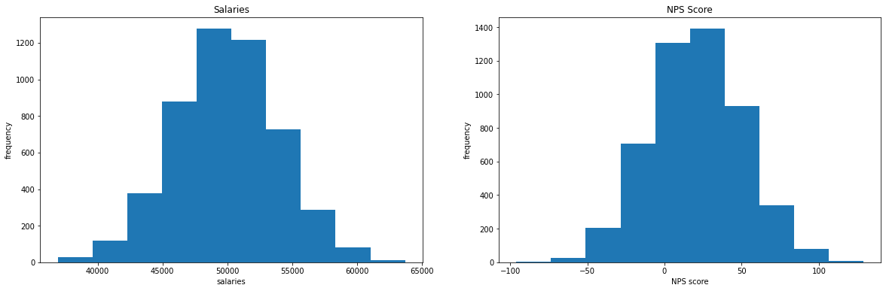
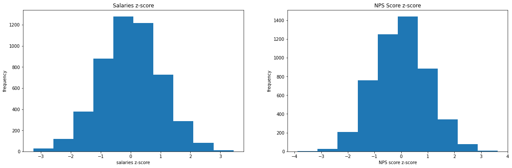
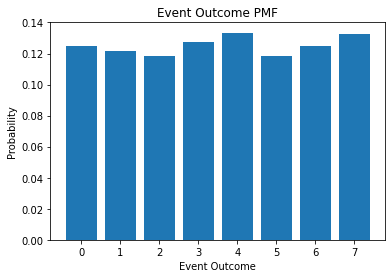
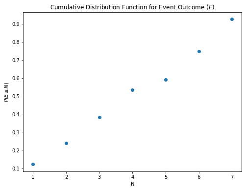
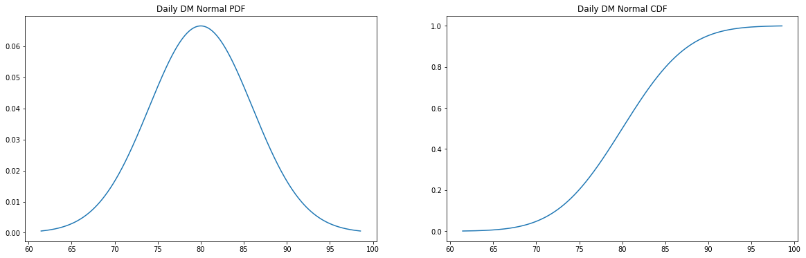

# Objectives
YW
* scrape a website for relevant information, store that information to a dataframe and save that dataframe as a csv file
* load in a dataframe and do the following
    * calculate the zscores of a given column
    * calculate the zscores of a point from a given column in the dataframe
    * calculate and plot the pmf and cdf of another column

# Part 1 - Webscraping
* use the following url scrape the first page of results
* for each item get the name of the item
* store the names to a dataframe and save that dataframe to csv then display
    * store the dataframe in the `data` folder in the repo
    * name the file `part1.csv` and make sure that when you write it you set `index=False`
* the head of the dataframe

* it should match the following


```python
url = "https://www.petsmart.com/dog/treats/dental-treats/#page_name=flyout&category=dog&cta=dentaltreat"
```


```python
# scrape the names of the items on the webpage above
import requests
resp = requests.get(url)
```


```python
from bs4 import BeautifulSoup
soup = BeautifulSoup(resp.content, "html.parser")
name_divs = soup.find_all('div', attrs={'class': 'product-name'})
```


```python
names = []
for name_div in name_divs:
    name = name_div.find('h3')
    names.append(name.text)
```


```python
# load the data into a dataframe file
import pandas as pd
df = pd.DataFrame(names)
```


```python
# save the data as a csv file
df.to_csv('./data/part1.csv')
```


```python
# display df.head()
df.head()
```


<div>
<style scoped>
    .dataframe tbody tr th:only-of-type {
        vertical-align: middle;
    }

    .dataframe tbody tr th {
        vertical-align: top;
    }

    .dataframe thead th {
        text-align: right;
    }
</style>
<table border="1" class="dataframe">
  <thead>
    <tr style="text-align: right;">
      <th></th>
      <th>0</th>
    </tr>
  </thead>
  <tbody>
    <tr>
      <th>0</th>
      <td>Greenies Regular Dental Dog Treats</td>
    </tr>
    <tr>
      <th>1</th>
      <td>Greenies Teenie Dental Dog Treats</td>
    </tr>
    <tr>
      <th>2</th>
      <td>Greenies Large Dental Dog Treats</td>
    </tr>
    <tr>
      <th>3</th>
      <td>Authority® Dental &amp; DHA Stick Puppy Treats Par...</td>
    </tr>
    <tr>
      <th>4</th>
      <td>Greenies Petite Dental Dog Treats</td>
    </tr>
  </tbody>
</table>
</div>


# Part 2

load in the csv file located in the `data` folder called `part2.csv`

create a function that calculates the zscores of an array

then calculate the zscores for each column in part2.csv and add them as columns

See below for final result


```python
# load in the dataframe, notice it only contains columns salaries, NPS Score, eventOutcome
df = pd.read_csv('data/part2.csv')
```


```python
def zscores(arr):
    """
    write a function that calculates 
    the zscores of a numpy arr, arr.
    """
    return [(x - arr.mean())/arr.std() for x in arr]
```


```python
# calculate the zscore for each column and store them as a new column with the names used above
for column in df.columns:
    z_col = column+'_zscore'
    df[z_col] = zscores(df[column])
```


```python
df.head()
```


<div>
<style scoped>
    .dataframe tbody tr th:only-of-type {
        vertical-align: middle;
    }

    .dataframe tbody tr th {
        vertical-align: top;
    }

    .dataframe thead th {
        text-align: right;
    }
</style>
<table border="1" class="dataframe">
  <thead>
    <tr style="text-align: right;">
      <th></th>
      <th>salaries</th>
      <th>NPS Score</th>
      <th>eventOutcome</th>
      <th>salaries_zscore</th>
      <th>NPS Score_zscore</th>
      <th>eventOutcome_zscore</th>
    </tr>
  </thead>
  <tbody>
    <tr>
      <th>0</th>
      <td>44112.0</td>
      <td>-7.0</td>
      <td>1</td>
      <td>-1.460155</td>
      <td>-0.913522</td>
      <td>-1.103166</td>
    </tr>
    <tr>
      <th>1</th>
      <td>46777.0</td>
      <td>-12.0</td>
      <td>2</td>
      <td>-0.793981</td>
      <td>-1.080668</td>
      <td>-0.668095</td>
    </tr>
    <tr>
      <th>2</th>
      <td>50013.0</td>
      <td>50.0</td>
      <td>5</td>
      <td>0.014926</td>
      <td>0.991947</td>
      <td>0.637118</td>
    </tr>
    <tr>
      <th>3</th>
      <td>48983.0</td>
      <td>-13.0</td>
      <td>0</td>
      <td>-0.242545</td>
      <td>-1.114097</td>
      <td>-1.538237</td>
    </tr>
    <tr>
      <th>4</th>
      <td>50751.0</td>
      <td>-11.0</td>
      <td>6</td>
      <td>0.199405</td>
      <td>-1.047239</td>
      <td>1.072189</td>
    </tr>
  </tbody>
</table>
</div>


# Part 3 
plot 'salaries' and 'NPS Score' on a subplot (1 row 2 columns) 
then repeat this for the zscores

see image below for reference


```python
# plot for raw salaries and NPS Score data goes here
import matplotlib.pyplot as plt
fig, (ax1, ax2) = plt.subplots(1,2)
fig.set_figheight(6)
fig.set_figwidth(20)
fig.set
df['salaries'].hist(ax=ax1)
ax1.set(title = 'Salaries', xlabel='salaries', ylabel='frequency')
ax1.grid(False)
df['NPS Score'].hist(ax=ax2)
ax2.set(title = 'NPS Score', xlabel='NPS score', ylabel='frequency')
ax2.grid(False)
```





```python
import matplotlib.pyplot as plt
fig, (ax1, ax2) = plt.subplots(1,2)
fig.set_figheight(6)
fig.set_figwidth(20)
fig.set
df['salaries_zscore'].hist(ax=ax1)
ax1.set(title = 'Salaries z-score', xlabel='salaries z-score', ylabel='frequency')
ax1.grid(False)
df['NPS Score_zscore'].hist(ax=ax2)
ax2.set(title = 'NPS Score z-score', xlabel='NPS score z-score', ylabel='frequency')
ax2.grid(False)
```





```python
# plot for zscores for salaries and NPS Score data goes here
```

# Part 4 - PMF
using the column 'eventOutcomes'

create a PMF and plot the PMF as a bar chart

See image below for referenc


```python
eventOutcomes = list(df['eventOutcome'])
pmf = dict()
N = len(eventOutcomes)
for outcome in eventOutcomes:
    pmf[outcome] = pdf.get(outcome,0) + 1/N
```


```python
fig = plt.figure(figsize=(6,4));
plt.bar(pmf.keys(), pmf.values());
plt.title('Event Outcome PMF');
plt.xlabel('Event Outcome');
plt.ylabel('Probability');
```





# Part 5 - CDF
plot the CDF of Event Outcomes as a scatter plot using the information above

See image below for reference 


```python
cdf = dict()
for j in range(len(pmf)):
    for k in range(j):
        cdf[j] = cdf.get(j,0) + pdf[j]
```


```python
fig = plt.figure(figsize=(8,6))
plt.scatter(cdf.keys(), cdf.values())
plt.title('Cumulative Distribution Function for Event Outcome ($E$)')
plt.xlabel(r'N')
plt.ylabel(r'$P(E \leq N)$')
```


    Text(0, 0.5, '$P(E \\leq N)$')





# Level Up:
* using np.where find salaries with zscores <= -2.0

* calculate the skewness and kurtosis for the NPS Score column

* plot the pdf and cdf of a given distribution


```python
# find salaries with zscores <= 2.0 
df.query('salaries_zscore <= 2.0')['salaries']
```


    0       44112.0
    1       46777.0
    2       50013.0
    3       48983.0
    4       50751.0
             ...   
    4995    50580.0
    4996    54526.0
    4997    46135.0
    4998    47223.0
    4999    47913.0
    Name: salaries, Length: 4881, dtype: float64


```python
# calculate skewness and kurtosis of NPS Score column
import scipy.stats as stats
NPS = df['NPS Score']
print('NPS Skewness: ', stats.skew(NPS))
print('NPS Kurtosis: ', stats.kurtosis(NPS, fisher=False))
```

    NPS Skewness:  0.02450527688165856
    NPS Kurtosis:  2.9578728553831883


# Plotting a pdf and cdf of a normal distribution
A survey is taken that finds that students send an mean average of 80 DMs a day with a standard deviation of 6 DMS. 


```python
import numpy as np
# plot the pdf and cdf of this normal distribution. level up if you can do it in subplots
fig, (ax1, ax2) = plt.subplots(1,2)
fig.set_figheight(6)
fig.set_figwidth(20)
NormalDist = stats.norm(80,6)
x_min = NormalDist.ppf(0.001)
x_max = NormalDist.ppf(0.999)
x = np.linspace(x_min,x_max,1000)
pdf = NormalDist.pdf(x)
cdf = NormalDist.cdf(x)
ax1.plot(x, pdf)
ax1.set_title('Daily DM Normal PDF')
ax2.plot(x, cdf)
ax2.set_title('Daily DM Normal CDF')
```


    Text(0.5, 1.0, 'Daily DM Normal CDF')





```python
# what is the probability of drawing a student that sends at least 82 DMs a day?
P = 1 - NormalDist.cdf(82)
print('The probability of drawing a student that sends at least 82 DMs per day is:', round(P, 2))
```

    The probability of drawing a student that sends at least 82 DMs per day is: 0.37


A second survey is taken at another bootcamp that shows that students send a mean average of
80 DMs a day, but they have a standard deviation of 9 DMS.  


```python
# What is the difference in the probability of finding a student that sends, at most, 65 DMs a day? 
NormalDist2 = stats.norm(80, 9)
P1 = NormalDist.cdf(65)
P2 = NormalDist2.cdf(65)
print('The probability of selecting a student who sends at most 65 DMs per day:')
print(' * Group 1: ', P1)
print(' *Group 2: ', P2)
```

    The probability of selecting a student who sends at most 65 DMs per day:
     - Group 1:  0.006209665325776132
     - Group 2:  0.0477903522728147


# run the cell below to convert your notebook to a README for assessment


```python
!jupyter nbconvert --to markdown assessment.ipynb && mv assessment.md README.md
```
